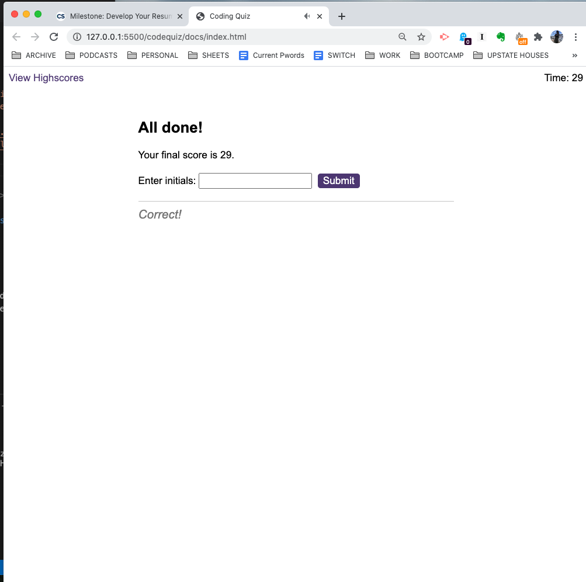

# Code Trivia Game

## Description:
Using Javascript, HTML, and CSS, this is a fun code quiz using timers, scoring, and special effects to engage with the user to learn the correct answers to the questions posed.

## Technologies Used:
* Structure:
  - HTML
* Design/Frameworks:
  - CSS
* Functionality:
  - Javascript
  - Local Storage

### Deployed Github Page
* [Github Page](https://qudoki.github.io/codequiz/)

### Screenshots
Here is the functioning quiz in the first question.

Here is the displayed wrong answer text that shows upon answering incorrectly.

Here is the highscores display at the end of the quiz that logs the leftover time.

### Note to Regrader:
* Fixed the penalty of 10 seconds to 15 seconds
* Previously had user keep on question until answered correctly. Upon revisiting instructions, revised to add displayNextQuestion function call to wrong answer if/else statement
* Completed ReadMe

### License
* [Link to License](./assets/LICENSE.md)