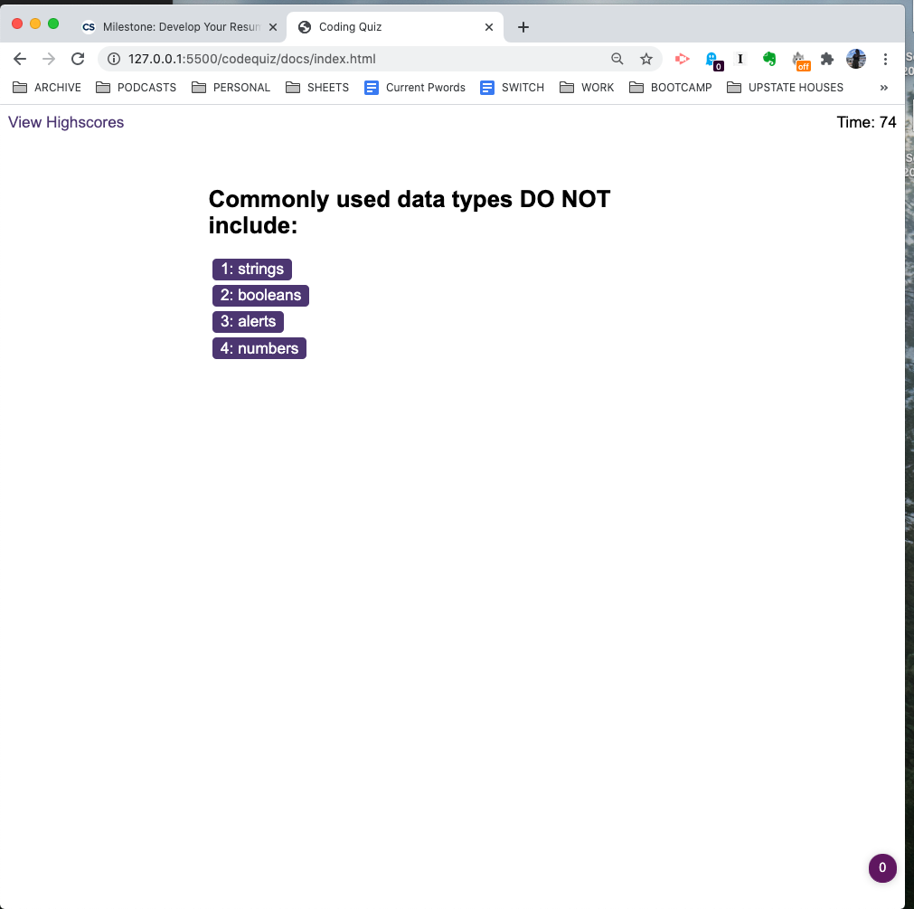
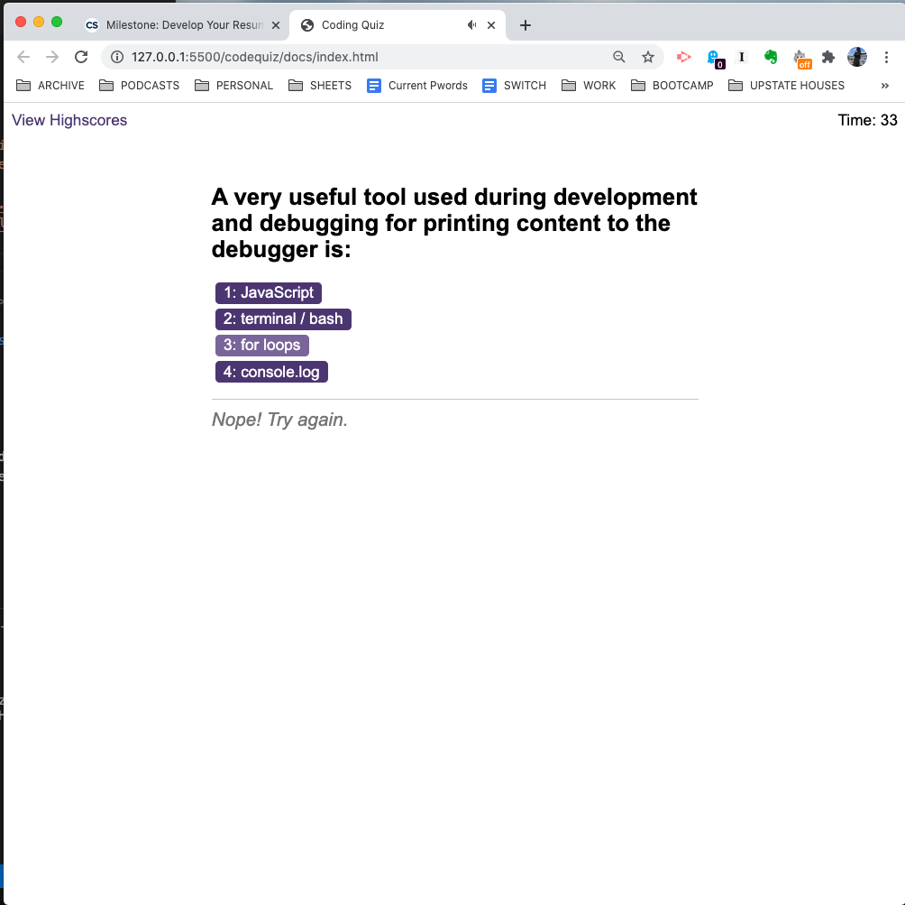

# Trivia Game

## Using Javascript, HTML, and CSS, this is a code quiz using timers, scoring, and special effects.

* Link to Functioning App: https://qudoki.github.io/codequiz/

* Link to Repo: https://github.com/qudoki/codequiz

### Here is the functioning quiz in the first question.

### Here is the displayed wrong answer text that shows upon answering incorrectly.

### Here is the highscores display at the end of the quiz that logs the leftover time.

### Note to Regrader:
-Fixed the penalty of 10 seconds to 15 seconds
-Previously had user keep on question until answered correctly. Upon revisiting instructions, revised to add displayNextQuestion function call to wrong answer if/else statement
-Completed ReadMe